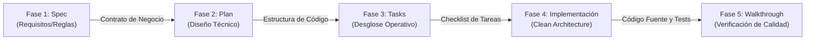

# Documento de Diseño de Software (SDD) & Desarrollo Guiado por Especificaciones (Spec-Driven Development)

Este documento detalla formalmente el diseño de software de la plataforma **SIGERI** (Sistema de Gestión de Riesgos de Ciberseguridad Industrial), estructurado y desarrollado bajo la metodología de **Desarrollo Guiado por Especificaciones (Spec-Driven Development - SDD)**, las directrices de **Especificaciones Abiertas (Open Specs)** y los principios de **Desarrollo Seguro de Software (Secure Software Development - SSD)**.

---

## 🔄 1. Ciclo de Vida del Software basado en SDD (Spec-Driven Development)

El **Desarrollo Guiado por Especificaciones (SDD)** es un paradigma moderno de ingeniería de software que establece las especificaciones humanas y legibles por máquinas como la **fuente única de verdad (Single Source of Truth - SSoT)** del proyecto. Esto evita la deriva de diseño ("design drift") y asegura que todo el código generado por desarrolladores y agentes de Inteligencia Artificial (IA) mantenga un alineamiento matemático y lógico con los requerimientos aprobados.

### El Flujo de Trabajo Secuencial y Contractual de SDD
El ciclo de vida del software en SIGERI sigue una tubería de 5 fases secuenciales, donde cada fase produce un artefacto específico en formato Markdown (`.md`):



#### 📋 Detalle Operativo de las Fases:
1.  **Fase 1: Especificación (Spec)**:
    *   **Objetivo**: Definir el qué del sistema. Contempla el inventario de activos, matrices de riesgos 5x5, tratamientos y controles normativos (ISO 27001 / NIST CSF).
    *   **Artefacto**: Contratos de entrada y reglas generales guardados en [.github/copilot-instructions.md](file:///c:/Users/USUARIO/source/repos/SIGERI.Web/.github/copilot-instructions.md).
2.  **Fase 2: Planificación (Plan)**:
    *   **Objetivo**: Definir el cómo técnico. Detalla la arquitectura de base de datos, capas de persistencia y estructura de dependencias.
    *   **Artefacto**: `implementation_plan.md` (diseño y plano arquitectónico aprobado).
3.  **Fase 3: Tareas (Tasks)**:
    *   **Objetivo**: Desglosar el plan en micro-tareas accionables y atómicas para el control preciso del avance y evitar deudas técnicas.
    *   **Artefacto**: `task.md` (TODO list activo).
4.  **Fase 4: Implementación (Implementation)**:
    *   **Objetivo**: Escribir código fuente acoplado estrictamente a las fases 2 y 3.
    *   **Resultado**: Código en C# (.NET 10), inyección de dependencias, base de datos local y suites de pruebas.
5.  **Fase 5: Cierre (Walkthrough)**:
    *   **Objetivo**: Validar el 100% de la funcionalidad implementada.
    *   **Artefacto**: `walkthrough.md` (reporte final de smoke testing y cobertura de pruebas).

---

## 📂 2. Arquitectura de Especificaciones Abiertas (Open Specs)

La filosofía de **Especificaciones Abiertas (Open Specs)** define que la documentación técnica no es un elemento pasivo, sino **Código Vivo ("Documentation as Code")**. Todos los archivos se almacenan en el sistema de control de versiones (Git) junto con el código fuente en formato Markdown (`.md`), lo que permite:
*   **Independencia de Herramientas**: Sin silos en portales web propietarios. El diseño se lee y escribe con cualquier editor de texto o IDE.
*   **Agent-Agnostic**: Los agentes de IA de codificación (Gemini, Copilot, etc.) pueden leer instantáneamente el estado exacto de la arquitectura sin interpretaciones ambiguas.
*   **Auditoría y Trazabilidad**: Cada cambio en el diseño tiene un historial de commits en Git, permitiendo saber quién, cuándo y por qué modificó una regla de negocio.

### Estructura de Documentos en la Raíz:
*   **[README.md](file:///c:/Users/USUARIO/source/repos/SIGERI.Web/README.md)**: Manual y especificación general del sistema, entorno y despliegue.
*   **[PROJECT_STATUS.md](file:///c:/Users/USUARIO/source/repos/SIGERI.Web/PROJECT_STATUS.md)**: Reporte detallado de cobertura, mitigación de riesgos de código y cumplimiento del ciclo de vida.
*   **[SDD.md](file:///c:/Users/USUARIO/source/repos/SIGERI.Web/SDD.md)**: Este documento de especificación arquitectónica y flujo SDD.

---

## 🧰 3. Caja de Herramientas de Especificación (Spec Kits)

El **Spec Kit** define las estructuras estándar para la creación de planes, control de tareas y validaciones de cierre, asegurando consistencia en la documentación:

### A. Estructura del Plan de Implementación (`implementation_plan.md`)
```markdown
# [Descripción del Objetivo e Impacto]
## Revisión del Usuario Requerida (Decisiones de Diseño)
## Preguntas Abiertas (Resolución de Incertidumbres)
## Cambios Propuestos
### [Nombre del Componente]
#### [NEW / MODIFY / DELETE] [Ruta del Archivo]
## Plan de Verificación (Tests Automatizados y Pruebas Manuales)
```

### B. Estructura del Checklist de Tareas (`task.md`)
```markdown
# Backlog de Tareas
- [ ] Tarea pendiente
- [/] Tarea en desarrollo
- [x] Tarea completada exitosamente y verificada
```

### C. Estructura del Reporte de Cierre (`walkthrough.md`)
```markdown
# Cierre del Ciclo - Walkthrough
## Cambios Realizados y Modificaciones al Código (Diffs)
## Resultados de Pruebas Automatizadas (Unitarias y de Integración)
## Evidencia de Interfaz de Usuario (Screenshots y Capturas de Pantalla)
```

---

## 🛡️ 4. Aseguramiento del Desarrollo Seguro de Software (SSD)

La arquitectura de SIGERI aplica estrictamente los principios de **SSD (Secure Software Development)** en cada capa de su estructura de desarrollo:

### Clean Architecture & DDD (Domain-Driven Design)
La separación física de responsabilidades impide fugas de seguridad entre componentes:

```
┌────────────────────────────────────────────────────────────────────────┐
│                       SIGERI.Web (Presentación)                        │
│         ASP.NET MVC 10 - CSRF Protection - Secure Session Cookies      │
└───────────────────────────────────┬────────────────────────────────────┘
                                    ▼
┌────────────────────────────────────────────────────────────────────────┐
│                     SIGERI.Application (Casos de Uso)                   │
│        MediatR Pipeline - Sanitización con FluentValidation            │
└───────────────────────────────────┬────────────────────────────────────┘
                                    ▼
┌────────────────────────────────────────────────────────────────────────┐
│                        SIGERI.Domain (Core)                            │
│           Modelado Puro - Value Objects - Cero dependencias            │
└────────────────────────────────────────────────────────────────────────┘
                                    ▲
┌────────────────────────────────────────────────────────────────────────┐
│                    SIGERI.Infrastructure (Persistencia)                │
│     EF Core (SQL Parametrizado) - PBKDF2/SHA-256 Password Hashing      │
└────────────────────────────────────────────────────────────────────────┘
```

*   **Dominio Puro (`SIGERI.Domain`)**: Las entidades encapsulan sus invariantes y reglas críticas usando objetos de valor (Value Objects), asegurando que el estado del negocio sea matemáticamente válido antes de tocar la persistencia.
*   **Pipeline de Validación (`SIGERI.Application`)**: Un decorador de comportamiento global (`ValidationBehavior<TRequest, TResponse>`) intercepta automáticamente cada comando de MediatR antes de su ejecución, validando y sanitizando los datos de entrada mediante validadores específicos. Si falla, interrumpe el flujo previniendo estados inválidos.
*   **Persistencia Segura e Inyección SQL (`SIGERI.Infrastructure`)**: Las operaciones de base de datos se ejecutan a través de Entity Framework Core utilizando sentencias SQL parametrizadas nativamente, bloqueando ataques de Inyección SQL.
*   **Cifrado de Credenciales**: Se utiliza un cifrado robusto basado en **PBKDF2 con sal aleatoria única y algoritmo SHA-256** para resguardar las credenciales de usuario, previniendo lecturas directas en caso de compromiso de base de datos.
*   **Pruebas de Integración con Base de Datos Real**: Se utiliza **Testcontainers** para levantar de forma aislada contenedores Docker de **Microsoft SQL Server 2022**, aplicando las migraciones reales y probando de forma fidedigna los flujos de auditoría, constraints y soft-delete antes del despliegue en producción.
