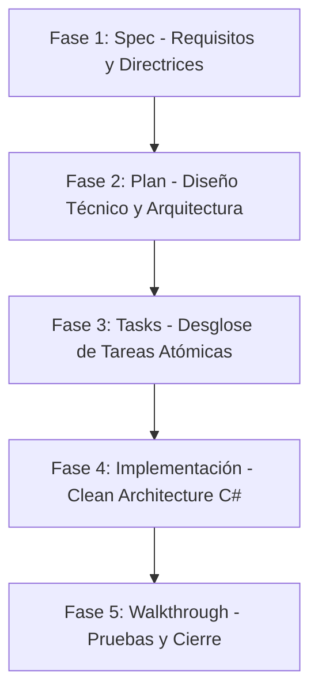

# Documento de Diseño de Software (SDD) & Spec-Driven Development (SDD)

Este documento detalla las especificaciones de diseño de software (SDD) aplicadas al sistema **SIGERI**, estructurado bajo la metodología de **Desarrollo Guiado por Especificaciones (Spec-Driven Development)**, especificaciones abiertas (**Open Specs**) y el ciclo de desarrollo seguro (**SSD**).

---

## 🔄 1. Ciclo de Vida del Software basado en SDD (Spec-Driven Development)

En lugar de codificar directamente sobre requisitos informales, el desarrollo de SIGERI se rige por un flujo de fases contractuales estructuradas mediante artefactos Markdown, garantizando la trazabilidad desde la especificación hasta el despliegue.



### Detalle del Flujo de Trabajo
*   **Fase 1 (Spec)**: Entrada de requerimientos funcionales, inventario de activos, y directrices de UI/UX cargadas desde [.github/copilot-instructions.md](file:///c:/Users/USUARIO/source/repos/SIGERI.Web/.github/copilot-instructions.md).
*   **Fase 2 (Plan)**: Generación del plan técnico detallando cambios por componente, diagramas y plan de pruebas.
*   **Fase 3 (Tasks)**: Desglose en un checklist operativo para auditoría de avance.
*   **Fase 4 (Implementación)**: Ejecución del código basado en la especificación aprobada.
*   **Fase 5 (Walkthrough)**: Validación integral y pruebas unitarias/integración.

---

## 📂 2. Especificaciones Abiertas (Open Specs)

Las especificaciones del sistema son **human-readable** y **machine-interpretable**, almacenadas como archivos Markdown (`.md`) para garantizar que cualquier desarrollador humano o agente de Inteligencia Artificial (IA) pueda comprender la estructura del software sin acoplamiento a herramientas propietarias.

### Índice de Especificaciones en la Raíz del Proyecto:
1.  **[README.md](file:///c:/Users/USUARIO/source/repos/SIGERI.Web/README.md)**: Especificación general de la plataforma, requisitos de compilación y comandos de ejecución.
2.  **[PROJECT_STATUS.md](file:///c:/Users/USUARIO/source/repos/SIGERI.Web/PROJECT_STATUS.md)**: Estado técnico de la cobertura de pruebas unitarias/integración y cumplimiento del ciclo de vida del software (SDLC).
3.  **[SDD.md](file:///c:/Users/USUARIO/source/repos/SIGERI.Web/SDD.md)**: Este documento (especificación del flujo de diseño de software y SDD).

---

## 🧰 3. Plantillas de Especificación (Spec Kit Templates)

El **Spec Kit** es el conjunto de plantillas estandarizadas para guiar el desarrollo en cada fase.

### A. Plantilla de Plan de Implementación (`implementation_plan.md`)
Utilizada en la fase de diseño para proponer cambios estructurados:
```markdown
# [Descripción del Objetivo]
## Modificaciones del Usuario Requeridas
## Cambios Propuestos
### [Nombre del Componente]
#### [MODIFY / NEW / DELETE] [Nombre del Archivo]
## Plan de Verificación
```

### B. Plantilla de Tareas de Desarrollo (`task.md`)
Utilizada para el desglose y control de tareas del sprint:
```markdown
# Tareas
- [ ] Tarea no completada
- [/] Tarea en progreso
- [x] Tarea completada con éxito
```

### C. Plantilla de Cierre (`walkthrough.md`)
Utilizada para certificar la entrega y los resultados de las pruebas:
```markdown
# Cierre del Rediseño - Walkthrough
## Cambios Implementados
## Resultados de las Pruebas Automatizadas
## Evidencia del Frontend
```

---

## 🛡️ 4. Desarrollo Seguro de Software (SSD)

El diseño arquitectónico de SIGERI implementa de extremo a extremo las mejores prácticas de **SSD (Secure Software Development)**:

*   **Arquitectura Limpia**: Separación física entre la lógica del Dominio (libre de dependencias), las Aplicaciones (casos de uso y validación estricta de solicitudes con **FluentValidation**) y la Infraestructura (persistencia segura y hashing de contraseñas con **PBKDF2/SHA-256**).
*   **Seguridad Web Integrada**: Protección CSRF global, cookies HttpOnly seguras y encriptadas, y parametrización automática de consultas SQL mediante Entity Framework Core.
*   **Pruebas de Integración Reales**: Las pruebas de integración se ejecutan contra un motor real de base de datos SQL Server levantado dinámicamente con **Testcontainers** y Docker, garantizando que las restricciones y la lógica de base de datos se validen de forma real antes de cualquier despliegue en producción.
